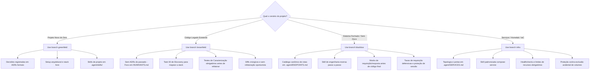

# Central de Templates Orientados a Agentes (ADD - Agent-Driven Development)

Este repositório é o **Hub Central** de starters e padrões de governança para desenvolvimento de software colaborativo com **agentes de Inteligência Artificial** (ex: Antigravity, Claude Code, Cursor, Windsurf, Roo Code, Aider, etc.).

A estrutura resolve os maiores gargalos no uso de agentes autônomos em ambientes reais: **perda de contexto em tarefas longas**, **alucinação de contratos**, **refatorações destrutivas em legados** e **ausência de Definition of Done (DoD)**.

---

## 🌿 Organização dos Templates por Branches

Em vez de misturar múltiplos starters em uma árvore inchada, este repositório organiza seus templates em **branches especializadas e limpas**:

```text
                                  ┌───────────────────────────┐
                                  │        branch main        │
                                  │   (Documentação e Hub)    │
                                  └─────────────┬─────────────┘
                                                │
         ┌───────────────────┬──────────────────┴──────────────────┬───────────────────┐
         ▼                   ▼                                     ▼                   ▼
┌─────────────────┐ ┌─────────────────┐                   ┌─────────────────┐ ┌─────────────────┐
│branch greenfield│ │branch brownfield│                   │ branch blackbox │ │  branch infra   │
│Projetos do Zero │ │Projetos Exist.  │                   │Engenharia Rever.│ │ Serviços & IaC  │
└─────────────────┘ └─────────────────┘                   └─────────────────┘ └─────────────────┘
```

| Branch | Foco do Projeto | Principais Componentes | Quando Usar |
| :--- | :--- | :--- | :--- |
| **`greenfield`** | Projetos iniciados **do zero** | `.agent/adr/` (ADRs formais), `.agent/skills/` (Skills locais), setup arquitetural livre, contratos em aberto. | Quando você vai criar uma nova aplicação, microserviço ou biblioteca do zero. |
| **`brownfield`** | Código **legado / já existente** | `.agent/INVARIANTS.md` (Cercas de Chesterton), `install.sh`, Task 00 de Discovery, testes de caracterização, política estrita de *no-push* (revisão humana obrigatória). | Quando você quer colocar agentes para trabalhar com segurança em um projeto que já existe e roda em produção. |
| **`blackbox`** | **Engenharia Reversa & Integração** | `.agent/ENDPOINTS.md` (Catálogo de rotas descobertas), `.agent/skills/reverse-engineering/`, `init.sh`, fixtures de replay e backoff defensivo. | Quando você precisa mapear, criar wrappers, scrapers ou integrar com sistemas legados/fechados sem documentação (ex: SEI/SIP). |
| **`infra`** | **Infraestrutura & Serviços** | `.agent/SERVICES.md` (Topologia e portas), `.agent/skills/compose-service/`, `compose.yaml.example`, `init.sh`, limites de recursos e healthchecks. | Quando você quer provisionar e orquestrar serviços (Docker Compose, VictoriaLogs, Uptime Kuma, bancos de dados, Homelab). |
| **`main`** | **Governança & Hub** | Documentação geral, matriz de decisão, histórico de evolução dos templates. | Para manter e consultar este ecossistema. |

---

## 🚀 Como Utilizar

### 1. Criando um Projeto do Zero (Greenfield)

Inicialize um novo projeto com repositório Git limpo via script one-liner:

```bash
curl -fsSL https://raw.githubusercontent.com/ye-sandbox/template-agent/greenfield/init.sh | bash -s -- meu-novo-projeto
cd meu-novo-projeto
```

*Ou via clone manual do Git:*
```bash
git clone --depth 1 -b greenfield https://github.com/ye-sandbox/template-agent.git meu-novo-projeto
cd meu-novo-projeto
rm -rf .git && git init -b main && git add . && git commit -m "chore: initial setup"
```

**Primeiro prompt para o agente no projeto novo:**
> *"Leia o AGENTS.md, .agent/TASK.md, .agent/NOTES.md e as skills em .agent/skills/. Apresente seu plano de implementação para a Tarefa Ativa do TASK.md antes de alterar qualquer código."*

---

### 2. Adotando em um Projeto Existente (Brownfield)

Você não precisa recriar seu projeto. Basta injetar a estrutura do agente na raiz do seu repositório existente:

```bash
# Estando na raiz do seu projeto legado existente:
curl -fsSL https://raw.githubusercontent.com/ye-sandbox/template-agent/brownfield/install.sh | bash
```

> 💡 **Dica:** Para automações ou CI sem confirmações interativas, use `bash -s -- -y`. Para instalar em um diretório específico, passe o caminho como argumento (`bash -s -- ./outro-caminho`).

*Ou clone a branch `brownfield` e execute `./install.sh /caminho/do/projeto` localmente.*

**Primeiro prompt para o agente no projeto legado:**
> *"Leia o AGENTS.md e o .agent/TASK.md. Apresente seu plano de implementação para a Tarefa [00.1] de Auditoria e Discovery do projeto antes de alterar qualquer código."*

---

### 3. Engenharia Reversa e Integração com Sistemas Fechados (Blackbox)

Para criar clientes, wrappers, scrapers ou integrações com sistemas sem documentação (como SEI, SIP ou ERPs monolíticos):

```bash
curl -fsSL https://raw.githubusercontent.com/ye-sandbox/template-agent/blackbox/init.sh | bash -s -- meu-projeto-sei
cd meu-projeto-sei
```

*Ou via clone manual do Git:*
```bash
git clone --depth 1 -b blackbox https://github.com/ye-sandbox/template-agent.git meu-projeto-sei
cd meu-projeto-sei
rm -rf .git && git init -b main && git add . && git commit -m "chore: initial setup"
```

**Primeiro prompt para o agente em engenharia reversa:**
> *"Leia o AGENTS.md, .agent/TASK.md, .agent/ENDPOINTS.md e a skill em .agent/skills/reverse-engineering/SKILL.md. Apresente seu plano para a Tarefa [00.1] de descoberta de autenticação antes de rodar requisições."*

---

### 4. Provisionando Infraestrutura e Serviços (Infra)

Para gerenciar e orquestrar serviços com Docker Compose, Homelab e IaC (como VictoriaLogs, Uptime Kuma, bancos e observabilidade):

```bash
curl -fsSL https://raw.githubusercontent.com/ye-sandbox/template-agent/infra/init.sh | bash -s -- meu-homelab
cd meu-homelab
```

*Ou via clone manual do Git:*
```bash
git clone --depth 1 -b infra https://github.com/ye-sandbox/template-agent.git meu-homelab
cd meu-homelab
rm -rf .git && git init -b main && git add . && git commit -m "chore: initial setup"
```

**Primeiro prompt para o agente em infraestrutura:**
> *"Leia o AGENTS.md, .agent/SERVICES.md, .agent/TASK.md e a skill em .agent/skills/compose-service/SKILL.md. Apresente seu plano para a Tarefa [00.1] de provisionamento base antes de alterar qualquer arquivo de configuração."*

---

## 🛡️ Comparativo de Filosofia e Governança



---

## 🤝 Como Contribuir ou Evoluir os Templates

Ao efetuar melhorias nos templates:
1. Mudanças que afetam exclusivamente a criação de novos projetos devem ser commitadas na branch **`greenfield`**.
2. Mudanças voltadas à proteção e auditoria de sistemas legados devem ser commitadas na branch **`brownfield`**.
3. Mudanças voltadas a scrapers e engenharia reversa devem ser commitadas na branch **`blackbox`**.
4. Mudanças voltadas a infraestrutura e Docker Compose devem ser commitadas na branch **`infra`**.
5. Mudanças na documentação geral, novas branches ou matrizes de governança pertencem à branch **`main`**.
6. **NUNCA** execute `git merge` entre branches de templates diferentes — use `git cherry-pick` para propagar commits pontuais (ver detalhes em [AGENTS.md](./AGENTS.md)).

---

## 🍴 Forks e Ambientes Corporativos (Self-Hosted)

Se você ou sua organização mantêm um **fork privado** deste repositório (GitHub Enterprise, GitLab, Gitea ou infraestrutura local), os scripts `init.sh` e `install.sh` são 100% parametrizáveis via a variável de ambiente **`TEMPLATE_REPO_URL`**:

### 1. Criar novo projeto Greenfield a partir do seu fork:
```bash
TEMPLATE_REPO_URL="https://github.com/SUA_ORGANIZACAO/template-agent.git" \
curl -fsSL https://raw.githubusercontent.com/SUA_ORGANIZACAO/template-agent/greenfield/init.sh | bash -s -- meu-novo-projeto
```

### 2. Injetar Brownfield em legado a partir do seu fork:
```bash
TEMPLATE_REPO_URL="https://raw.githubusercontent.com/SUA_ORGANIZACAO/template-agent/brownfield" \
curl -fsSL https://raw.githubusercontent.com/SUA_ORGANIZACAO/template-agent/brownfield/install.sh | bash
```

### 3. Criar projeto Blackbox a partir do seu fork:
```bash
TEMPLATE_REPO_URL="https://github.com/SUA_ORGANIZACAO/template-agent.git" \
curl -fsSL https://raw.githubusercontent.com/SUA_ORGANIZACAO/template-agent/blackbox/init.sh | bash -s -- meu-projeto-sei
```

### 4. Criar projeto Infra a partir do seu fork:
```bash
TEMPLATE_REPO_URL="https://github.com/SUA_ORGANIZACAO/template-agent.git" \
curl -fsSL https://raw.githubusercontent.com/SUA_ORGANIZACAO/template-agent/infra/init.sh | bash -s -- meu-homelab
```

### Sincronização do Fork com o Upstream
Para atualizar seu fork mantendo o isolamento estrito das branches:
```bash
git remote add upstream https://github.com/ye-sandbox/template-agent.git
git fetch upstream

# Atualize cada branch isoladamente (nunca faça merge entre branches de templates diferentes):
git checkout main && git merge upstream/main
git checkout greenfield && git merge upstream/greenfield
git checkout brownfield && git merge upstream/brownfield
git checkout blackbox && git merge upstream/blackbox
git checkout infra && git merge upstream/infra
```
