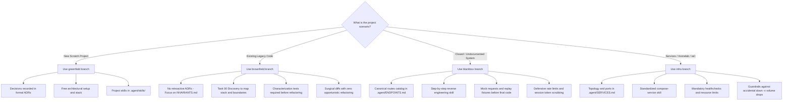

# Agent-Driven Development (ADD) Template Hub

🌐 **English | [Português](README.pt-br.md)**

This repository is the **Central Hub** for starters and governance standards designed for collaborative software engineering with **AI coding agents** (e.g., Antigravity, Claude Code, Cursor, Windsurf, Roo Code, Aider, etc.).

This framework directly resolves the primary failure modes of autonomous agents in production environments: **context window degradation on long tasks**, **contract hallucinations**, **destructive refactoring in legacy codebases**, and **lack of strict Definitions of Done (DoD)**.

---

## 🌿 Specialized Template Branches Architecture

Rather than bundling multiple disparate starters into a bloated monolithic directory tree, this repository isolates its templates into **clean, specialized branches**:

```text
                                  ┌───────────────────────────┐
                                  │        branch main        │
                                  │   (Documentation & Hub)   │
                                  └─────────────┬─────────────┘
                                                │
         ┌───────────────────┬──────────────────┴──────────────────┬───────────────────┐
         ▼                   ▼                                     ▼                   ▼
┌─────────────────┐ ┌─────────────────┐                   ┌─────────────────┐ ┌─────────────────┐
│branch greenfield│ │branch brownfield│                   │ branch blackbox │ │  branch infra   │
│Scratch Projects │ │Existing Legacies│                   │Reverse Eng./Scra│ │ Services & IaC  │
└─────────────────┘ └─────────────────┘                   └─────────────────┘ └─────────────────┘
```

| Branch | Project Scope | Core Components | When to Use |
| :--- | :--- | :--- | :--- |
| **`greenfield`** | Projects built **from scratch** | `.agent/adr/` (Formal ADRs), `.agent/skills/` (Starter skills), unconstrained architecture, open contracts. | When creating a brand new application, microservice, or library from zero. |
| **`brownfield`** | **Existing / Legacy** codebases | `.agent/INVARIANTS.md` (Chesterton's Fences), `install.sh`, Task 00 Discovery, characterization tests, strict *no-push* rule (mandatory human review). | When onboarding AI agents safely onto an existing production codebase. |
| **`blackbox`** | **Reverse Engineering & Integration** | `.agent/ENDPOINTS.md` (Discovered routes catalog), `.agent/skills/reverse-engineering/`, `init.sh`, replay fixtures, and defensive rate limiting. | When mapping, building clients/wrappers, or integrating with closed/undocumented legacy systems (e.g., enterprise portals, ERPs). |
| **`infra`** | **Infrastructure & Services** | `.agent/SERVICES.md` (Topology & ports), `.agent/skills/compose-service/`, `compose.yaml.example`, `init.sh`, resource limits, and healthchecks. | When provisioning and orchestrating services (Docker Compose, VictoriaLogs, Uptime Kuma, databases, Homelab). |
| **`main`** | **Governance Hub** | Global documentation, decision matrix, and template evolution history. | To maintain and consult this template ecosystem. |

Cross-cutting playbooks spanning **multiple** repositories (UI contract, proto, port, agent QA) are **not** versioned in this `main` branch. Canonical source: [`ye-sandbox/agent-skills`](https://github.com/ye-sandbox/agent-skills) (private). On host: clone + `./install.sh`. Starter-specific skills remain embedded in the corresponding branches above.

---

## 🚀 Quickstart

### 1. Creating a Project from Scratch (Greenfield)

Initialize a new project with a clean Git repository via one-line script:

```bash
curl -fsSL https://raw.githubusercontent.com/ye-sandbox/template-agent/greenfield/init.sh | bash -s -- my-new-project
cd my-new-project
```

*Or via manual Git clone:*
```bash
git clone --depth 1 -b greenfield https://github.com/ye-sandbox/template-agent.git my-new-project
cd my-new-project
rm -rf .git && git init -b main && git add . && git commit -m "chore: initial setup"
```

**Initial prompt for the agent in a greenfield project:**
> *"Read AGENTS.md, .agent/TASK.md, .agent/NOTES.md, and skills in .agent/skills/. Present your implementation plan for the Active Task in TASK.md before modifying any code."*

---

### 2. Adopting in an Existing Project (Brownfield)

No need to recreate your project. Inject the agent governance structure directly into your existing repository root:

```bash
# From the root of your existing legacy repository:
curl -fsSL https://raw.githubusercontent.com/ye-sandbox/template-agent/brownfield/install.sh | bash
```

> 💡 **Tip:** For non-interactive CI or automated runs, pass `bash -s -- -y`. To target a specific folder, provide the destination path (`bash -s -- ./target-dir`).

> 🔒 **Enterprise / Stealth Mode (`--local-only`):**
> When adopting in enterprise or shared repositories where AI governance files cannot be committed to shared git history:
> ```bash
> curl -fsSL https://raw.githubusercontent.com/ye-sandbox/template-agent/brownfield/install.sh | bash -s -- --local-only
> ```
> This automatically appends `/AGENTS.md` and `/.agent/` to `.git/info/exclude` (leaving `.gitignore` and `git status` untouched) and injects strict stealth guardrails forbidding staging AI files.

*Or clone the `brownfield` branch and run `./install.sh /path/to/project` (or with `--local-only`) locally.*

**Initial prompt for the agent in a legacy codebase:**
> *"Read AGENTS.md and .agent/TASK.md. Present your implementation plan for Task [00.1] Project Discovery & Audit before modifying any code."*

---

### 3. Reverse Engineering & Closed Systems (Blackbox)

To build clients, wrappers, scrapers, or integrations with undocumented systems:

```bash
curl -fsSL https://raw.githubusercontent.com/ye-sandbox/template-agent/blackbox/init.sh | bash -s -- my-blackbox-project
cd my-blackbox-project
```

*Or via manual Git clone:*
```bash
git clone --depth 1 -b blackbox https://github.com/ye-sandbox/template-agent.git my-blackbox-project
cd my-blackbox-project
rm -rf .git && git init -b main && git add . && git commit -m "chore: initial setup"
```

**Initial prompt for the agent in a blackbox project:**
> *"Read AGENTS.md, .agent/TASK.md, .agent/ENDPOINTS.md, and .agent/skills/reverse-engineering/SKILL.md. Present your plan for Task [00.1] Authentication Discovery before running live requests."*

---

### 4. Provisioning Infrastructure & Services (Infra)

To manage and orchestrate services with Docker Compose, Homelab, and IaC (e.g., VictoriaLogs, Uptime Kuma, databases, observability):

```bash
curl -fsSL https://raw.githubusercontent.com/ye-sandbox/template-agent/infra/init.sh | bash -s -- my-homelab
cd my-homelab
```

*Or via manual Git clone:*
```bash
git clone --depth 1 -b infra https://github.com/ye-sandbox/template-agent.git my-homelab
cd my-homelab
rm -rf .git && git init -b main && git add . && git commit -m "chore: initial setup"
```

**Initial prompt for the agent in an infrastructure repository:**
> *"Read AGENTS.md, .agent/SERVICES.md, .agent/TASK.md, and .agent/skills/compose-service/SKILL.md. Present your plan for Task [00.1] Baseline Service Provisioning before altering configuration files."*

---

## 🛡️ Governance & Philosophy Decision Tree



---

## 🤝 Contributing & Template Evolution

When making improvements to templates:
1. Changes affecting only brand-new project workflows belong to branch **`greenfield`**.
2. Changes improving legacy protection or brownfield auditing belong to branch **`brownfield`**.
3. Changes improving scrapers, fixtures, or reverse-engineering flows belong to branch **`blackbox`**.
4. Changes for Docker Compose, Homelab, or service orchestration belong to branch **`infra`**.
5. General hub documentation, new starter branches, or governance matrices belong to branch **`main`**.
6. **NEVER** run `git merge` between different template branches — use `git cherry-pick` for atomic propagation (see [AGENTS.md](./AGENTS.md)).

---

## 🍴 Forks & Enterprise Self-Hosted Environments

If you or your organization maintain a **private fork** of this repository (GitHub Enterprise, GitLab, Gitea, or local Git server), both `init.sh` and `install.sh` support custom upstream URLs via the **`TEMPLATE_REPO_URL`** environment variable:

### 1. Greenfield from a custom fork:
```bash
TEMPLATE_REPO_URL="https://github.com/YOUR_ORG/template-agent.git" \
curl -fsSL https://raw.githubusercontent.com/YOUR_ORG/template-agent/greenfield/init.sh | bash -s -- my-new-project
```

### 2. Brownfield from a custom fork:
```bash
TEMPLATE_REPO_URL="https://raw.githubusercontent.com/YOUR_ORG/template-agent/brownfield" \
curl -fsSL https://raw.githubusercontent.com/YOUR_ORG/template-agent/brownfield/install.sh | bash
```

### 3. Blackbox from a custom fork:
```bash
TEMPLATE_REPO_URL="https://github.com/YOUR_ORG/template-agent.git" \
curl -fsSL https://raw.githubusercontent.com/YOUR_ORG/template-agent/blackbox/init.sh | bash -s -- my-blackbox-project
```

### 4. Infra from a custom fork:
```bash
TEMPLATE_REPO_URL="https://github.com/YOUR_ORG/template-agent.git" \
curl -fsSL https://raw.githubusercontent.com/YOUR_ORG/template-agent/infra/init.sh | bash -s -- my-homelab
```

### Syncing Your Fork with Upstream
To update your fork while strictly preserving branch isolation:
```bash
git remote add upstream https://github.com/ye-sandbox/template-agent.git
git fetch upstream

# Update each branch in isolation (never merge across different template branches):
git checkout main && git merge upstream/main
git checkout greenfield && git merge upstream/greenfield
git checkout brownfield && git merge upstream/brownfield
git checkout blackbox && git merge upstream/blackbox
git checkout infra && git merge upstream/infra
```
