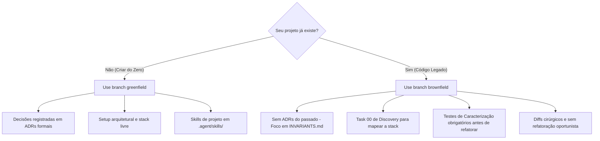

# Central de Templates Orientados a Agentes (ADD - Agent-Driven Development)

Este repositório é o **Hub Central** de starters e padrões de governança para desenvolvimento de software colaborativo com **agentes de Inteligência Artificial** (ex: Antigravity, Claude Code, Cursor, Windsurf, Roo Code, Aider, etc.).

A estrutura resolve os maiores gargalos no uso de agentes autônomos em ambientes reais: **perda de contexto em tarefas longas**, **alucinação de contratos**, **refatorações destrutivas em legados** e **ausência de Definition of Done (DoD)**.

---

## 🌿 Organização dos Templates por Branches

Em vez de misturar múltiplos starters em uma árvore inchada, este repositório organiza seus templates em **branches especializadas e limpas**:

```text
                                  ┌───────────────────────────┐
                                  │        branch main        │
                                  │   (Documentação e Hub)    │
                                  └─────────────┬─────────────┘
                                                │
                     ┌──────────────────────────┴──────────────────────────┐
                     ▼                                                     ▼
        ┌──────────────────────────┐                          ┌──────────────────────────┐
        │    branch greenfield     │                          │    branch brownfield     │
        │   Projetos do Zero       │                          │   Projetos Existentes    │
        └──────────────────────────┘                          └──────────────────────────┘
```

| Branch | Foco do Projeto | Principais Componentes | Quando Usar |
| :--- | :--- | :--- | :--- |
| **`greenfield`** | Projetos iniciados **do zero** | `.agent/adr/` (ADRs formais), `.agent/skills/` (Skills locais), setup arquitetural livre, contratos em aberto. | Quando você vai criar uma nova aplicação, microserviço ou biblioteca do zero. |
| **`brownfield`** | Código **legado / já existente** | `.agent/INVARIANTS.md` (Cercas de Chesterton), `install.sh`, Task 00 de Discovery, foco em testes de caracterização. | Quando você quer colocar agentes para trabalhar com segurança em um projeto que já existe e roda em produção. |
| **`main`** | **Governança & Hub** | Documentação geral, matriz de decisão, histórico de evolução dos templates. | Para manter e consultar este ecossistema. |

---

## 🚀 Como Utilizar

### 1. Criando um Projeto do Zero (Greenfield)

Clone diretamente a branch `greenfield` para uma nova pasta do seu projeto:

```bash
git clone -b greenfield https://github.com/ye-sandbox/template-agent.git meu-novo-projeto
cd meu-novo-projeto
git remote remove origin  # Desvincule do template e aponte para seu novo repositório
```

**Primeiro prompt para o agente no projeto novo:**
> *"Leia o AGENTS.md, .agent/TASK.md, .agent/NOTES.md e as skills em .agent/skills/. Apresente seu plano de implementação para a Tarefa Ativa do TASK.md antes de alterar qualquer código."*

---

### 2. Adotando em um Projeto Existente (Brownfield)

Você não precisa recriar seu projeto. Basta injetar a estrutura do agente na raiz do seu repositório existente:

```bash
# Estando na raiz do seu projeto legado existente:
curl -fsSL https://raw.githubusercontent.com/ye-sandbox/template-agent/brownfield/install.sh | bash
```

> 💡 **Dica:** Para automações ou CI sem confirmações interativas, use `bash -s -- -y`. Para instalar em um diretório específico, passe o caminho como argumento (`bash -s -- ./outro-caminho`).

*Ou clone a branch `brownfield` e execute `./install.sh /caminho/do/projeto` localmente.*

**Primeiro prompt para o agente no projeto legado:**
> *"Leia o AGENTS.md e o .agent/TASK.md. Apresente seu plano de implementação para a Tarefa [00.1] de Auditoria e Discovery do projeto antes de alterar qualquer código."*

---

## 🛡️ Comparativo de Filosofia e Governança



---

## 🤝 Como Contribuir ou Evoluir os Templates

Ao efetuar melhorias nos templates:
1. Mudanças que afetam exclusivamente a criação de novos projetos devem ser commitadas na branch **`greenfield`**.
2. Mudanças voltadas à proteção e auditoria de sistemas legados devem ser commitadas na branch **`brownfield`**.
3. Mudanças na documentação geral, novas branches ou matrizes de governança pertencem à branch **`main`**.
