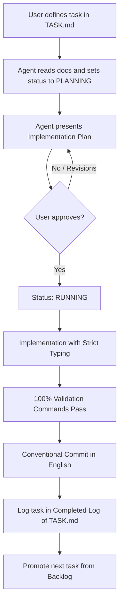

# Core / Greenfield Agent-Driven Development (ADD) Template

🌐 **English | [Português](README.pt-br.md)**

This repository is the canonical **Core / Greenfield** starter kit designed to empower software development from scratch with **AI coding agents** (e.g., Antigravity, Claude Code, Cursor, Windsurf, Roo Code, Aider, etc.).

The structure directly addresses the primary bottlenecks when using autonomous agents in real-world projects: **context loss**, **hallucinations during long tasks**, **violation of coding standards**, and **destructive rework**.

---

## 📁 Template Structure

```text
├── AGENTS.md                 # Project "Constitution" (strict rules, stack, MCPs, validation commands)
├── .agent/
│   ├── TASK.md               # Active task, acceptance criteria, and immediate roadmap
│   ├── NOTES.md              # Rapid architectural decisions, data contracts, and gotchas
│   ├── ARCHIVE.md            # Historical log of completed tasks (preserves lean context)
│   ├── adr/                  # Complex Architectural Decision Records (formal ADRs)
│   │   └── 000-template.md   # Standard ADR template
│   └── skills/               # Specialized procedural skills for the project
│       ├── README.md         # Guide on when and how to create skills
│       └── 000-template.md   # Standard SKILL.md template
├── .env.example              # Example environment variables
├── .gitignore                # Comprehensive defaults (Node, Python, Docker, agent caches)
└── README.md                 # This guide (for human developers)
```

---

## 🚀 Quickstart

### Option 1: Automated One-Liner (Recommended)

Bootstrap a new project instantly from your terminal:

```bash
curl -fsSL https://raw.githubusercontent.com/ye-sandbox/template-agent/greenfield/init.sh | bash -s -- my-new-project
```

The script clones the `greenfield` branch, initializes a fresh Git repository, and drops setup-only files automatically.

---

### Option 2: Manual Git Clone

```bash
git clone --depth 1 -b greenfield https://github.com/ye-sandbox/template-agent.git my-new-project
cd my-new-project
rm -rf .git && git init -b main
git add . && git commit -m "chore: initial template setup"
```

### Step 2: Configure `AGENTS.md`
Open [`AGENTS.md`](./AGENTS.md) and replace all placeholder fields in `[BRACKETS]`:
1. Project name and architectural overview.
2. Operating system and **default shell** (e.g., Bash or PowerShell).
3. Technology stack for each module/service (languages, versions, official package managers).
4. Authorized MCP servers and domain skills.
5. Exact validation commands (`test`, `lint`, `typecheck`, `build`).
6. Remove inapplicable sections (e.g. Docker section if containers are not used).
7. Delete the `Adaptation checklist` at the bottom when finished.

### Step 3: Configure Environment Variables & MCPs
Copy the example environment file and configure local values:
```bash
cp .env.example .env
```
If using MCP servers (local databases, API docs, observability), register them in your agent configuration (`antigravity`, `claude_desktop`, etc.).

### Step 4: Define the First Task in `.agent/TASK.md`
Open [`.agent/TASK.md`](./.agent/TASK.md):
1. Fill the **📌 Active Task** section with the initial concrete goal (e.g., `Bootstrap project skeleton and validation tooling`).
2. Specify clear, measurable **Acceptance Criteria**.
3. Set status to `READY FOR PLANNING`.

### Step 5: Begin Development with your AI Agent
Send the kickoff prompt in your AI agent interface:
> *"Read AGENTS.md, .agent/TASK.md, .agent/NOTES.md, and skills in .agent/skills/. Present your implementation plan for the Active Task in TASK.md before modifying any code."*

---

## 🔄 Task Lifecycle Workflow



---

## 💡 Best Practices for AI Agents

1. **One task at a time:** Keep tasks atomic. Break large goals into subtasks in `TASK.md`.
2. **Enforce DoD (Definition of Done):** Never accept tasks with failing tests or unaddressed linter errors.
3. **Keep context files lean:**
   - `TASK.md` holds only the active task and titles of upcoming items.
   - `NOTES.md` holds non-obvious rationale, contracts, and gotchas not evident from git diffs.
   - Deep implementation details belong in git commit messages and history.
